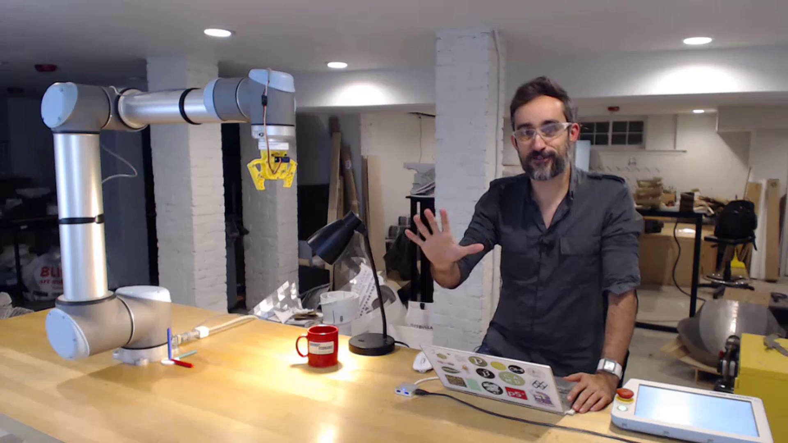

# Machina for Dynamo

A [Machina](https://github.com/garciadelcastillo/Machina)-based [Dynamo](http://dynamobim.org/) package for robot control.

## Setup
If you are not interested in the source code, just do the following:
- Make sure you have the latest version of Dynamo Studio. Open it.
- Go to `Packages > Search for a Package...` and type `Machina` on the searchbox. You should be able to install the latest version.

## Tutorials
There are a bunch of Dynamo files in the `extra` folder that comes with this package. You can find them if you go to `Packages > Manage Packages...`, then click on the options on the right of `Machina` and choose `Show Root Directory`. These files will help you understand how to setup a Machina project. I will write a dedicated walkthrough section sometime soon.

A full set of tutorials on how to use the Machina framework can be found here:

Tutorials playlist: https://www.youtube.com/playlist?list=PLvxxYImPCApXj3tHVKmpTS_AuMPngnA47

Instructions on how to setup your machine to work with the Machina framework can be found here: https://www.youtube.com/playlist?list=PLvxxYImPCApUffcv_KtdR-sQydA4O4CPH.

## Projects

A playlist of projects built by the community with different Machina flavors:
https://www.youtube.com/playlist?list=PLvxxYImPCApXZ-yBCUtGzVWb2ZhduaSXR

Here are some videos of things you can do with Machina for Dynamo:
- [Surface Milling](https://youtu.be/054s9XlslVs)
- [Metal Forming](https://youtu.be/_6Bbm7Scs4w)

🤖x❤️

